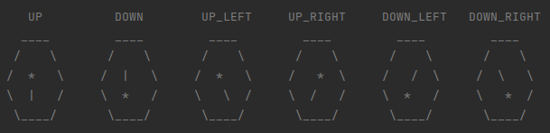

# :sparkles:  MDP Path-finding - Hexbot AI

### Description:
This project is developed to assess the understanding of fundamental concepts of reinforcement learning. 
This fundamental concepts include ***Markov decision processes, State-Value Functions, 
Action-Value functions, Policies, Bellman equations, Policy iteration and Value iteration***.

### Problem Statement
The hexbot world is made of hexagonal tiles as shown in Fig. 1. There is one robot (we call it Hexbot)
and there are one/multiple objects. Some tiles on the world are targets and some are hazards. The task is
we need to train the hexbot to pick all the objects and put them onto target positions while avoiding any collision
with other objects as well as avoiding hazards.

    
    Figure - 1 (Hexbot environment)

The Hexbot is denoted using (R *) in a tile. Here the * denotes the direction which hexbot is facing.
The hazards are shown using 'x' and targets are denoted using 'tgt'. Various objects are denoted using
alphabets where capital alphabets denote the center of respective object.

> [!WARNING]
> Moreover, there are some stochasticity in the environment. Whenever the robot decides to perform an action, there are 
chances that it may drift left / right (but not both) before performing the move. There are also chances that the action
will be performed twice.

Possible robot orientations are shown below

Objects can be of three types.

<table>
    <tr>
        <td>Object type</td>
        <td>Orientations</td>
    </tr>
    <tr>
        <td>3 Tile object</td>
        <td></td>
    </tr>
    <tr>
        <td>4 Tile object</td>
        <td></td>
    </tr>
    <tr>
        <td>5 Tile object</td>
        <td></td>
    </tr>
</table>

### Solution:
We consider this problem as a markov decision process and use the value iteration and policy iteration algorithms to find
an optimal policy.

### Demo:

https://github.com/bhaveshachhada/rl-hexbot/assets/50368853/ba3f002e-a90f-4889-9f29-2758bf928826

